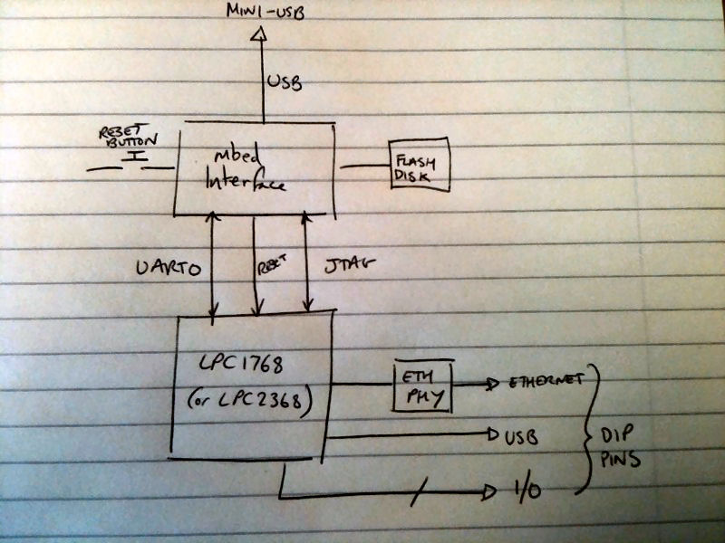

# How mbed works

The mbed hardware architecture is designed to make sure you have all the tools and utilities to be productive. Most boards have an integrated debug circuit used for assisting in development by programming the device, logging program execution and giving access to the debug access port. Here is how it works...

## Architecture diagram

This is the basic architecture of an mbed board:

## How programming works

There are two options:

1. When you plug an mbed Enabled board to your PC using USB, it appears as a USB flash disk. This small disk is presented by the mbed Interface, and allows you to save ARM microcontroller binaries you want to run directly on to the board, without needing drivers.
2. The same USB connector exposes a debug protocol such as CMSIS-DAP. This enabled lots of IDEs to program and debug the device.

## How USB serial works

The mbed Interface also presents a USB serial/com interface. This is basically a UART-USB bridge, and connects to the interface's UART. So if you send characters out of the target board's UART, they will be read by the mbed Interface and transferred over the USB link. When you ``printf()``, it is just sending characters to UART. This means that if you make your own PCB, these characters will still appear on UART.

## Notes

The ``.bin`` files the mbed microcontroller accepts are standard raw ARM binaries, and can be generated by any compiler you like. You have bare-metal control of the target microcontroller, as the separate interface manages programming over JTAG or SWD - we don't use a bootloader or monitor on the target. So you really are just loading on a raw binary. This means you can build your own PCB using the same target microcontroller, and the same program binary will run on that. 

# The mbed Interface

More information about the mbed Interface and the circuits on which it runs can be found in the HDK reference manual or on the [DAPLink GitHub page](https://github.com/ARMmbed/DAPLink/blob/master/README.md). The HDK includes reference circuits you can use to create your own boards, and DAPLink is the firmware that runs on these circuits.

## Connectivity

The best representation of the connectivity of the mbed interface is the same diagram we showed above.

The headlines are that it:

- Provides a USB connection to the host computer, which exposes a Mass Storage (flash disk) and a USB Serial Port.

- Has an SWD or JTAG connection to the target, so that it can program the target flash. You can also use this for debugging.

- A physical UART connection exists between the target and the interface which is relayed over the interface's USB Serial port.

